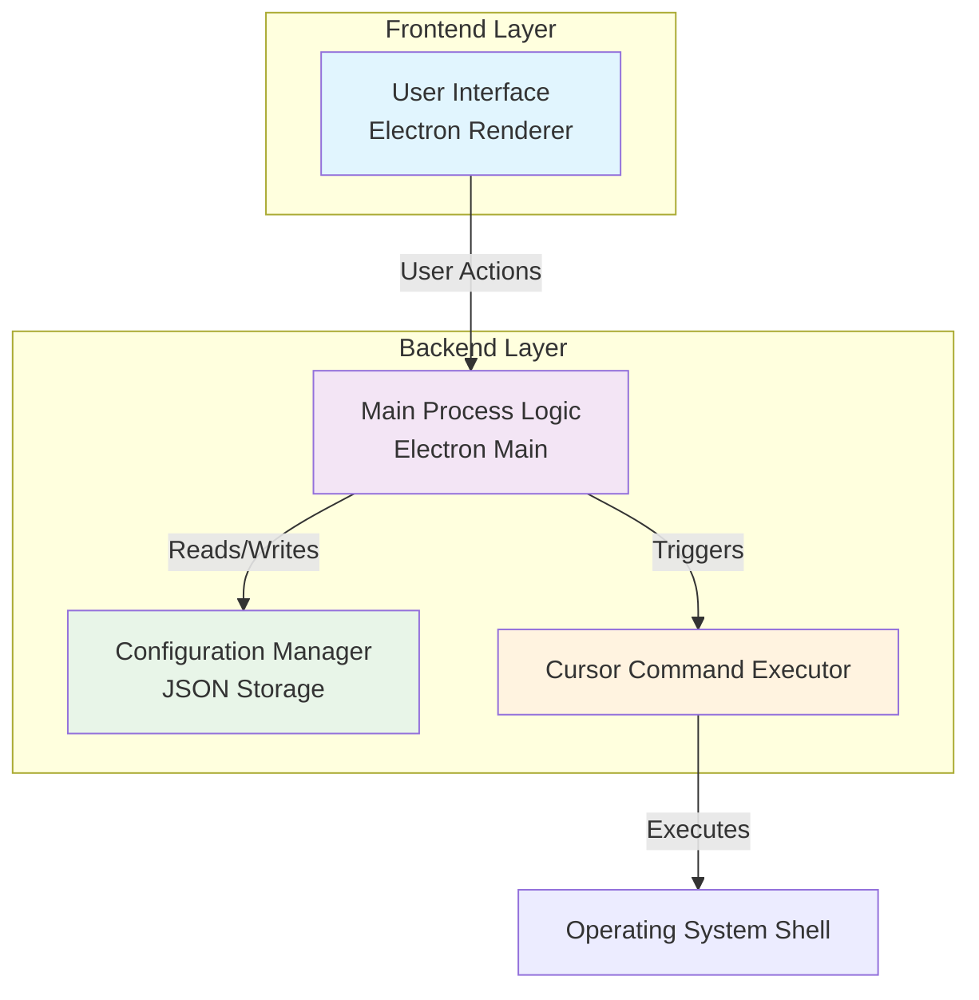
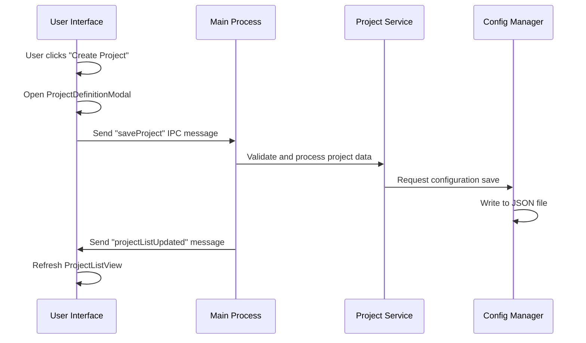
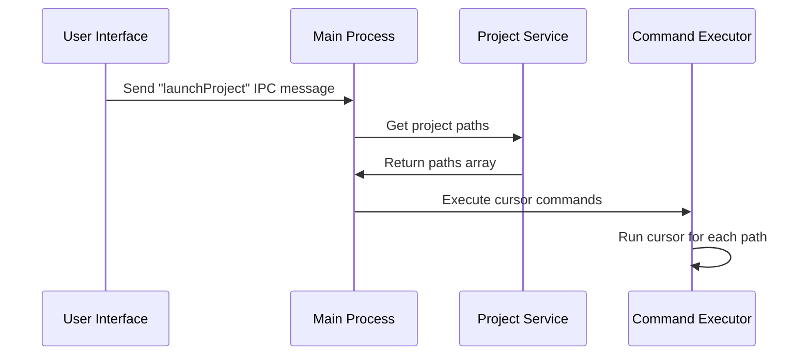

# Cursor Project Launcher - Architecture Plan

## 📋 Project Overview

**Core Objective:**  
Develop a GUI application that simplifies launching single or multiple Cursor editor windows for predefined directories or "projects."

## ✨ Key Features

- **Directory Management**
  - List recently opened individual directories
  - Add/remove individual directories with one-click access
  - One-click launch for individual directories (`cursor <path-to-directory>`)

- **Project Management**
  - Define "Projects" consisting of one or more directory paths
  - List and manage defined projects
  - One-click launch for projects (opens multiple `cursor` instances)

- **Data Persistence**
  - Persist directory and project configurations
  - Maintain user preferences and recent activity

## 🏗️ System Architecture



## 🔧 Component Specifications

### 1. User Interface (Electron Renderer Process)

**Responsibility:** Visual elements and user interaction handling

#### Sub-components:

| Component | Description | Key Actions |
|-----------|-------------|-------------|
| `MainWindowView` | Main application window container | Display overall layout |
| `DirectoryListView` | Individual directories management | Add, Remove, Launch Directory |
| `ProjectListView` | Project management interface | Create, Edit, Delete, Launch Project |
| `ProjectDefinitionModal` | Project creation/editing dialog | Multi-directory selection |
| `DirectoryPicker` | Native file dialog integration | Directory selection |

#### Interactions:
- **Outbound:** Sends commands via Electron IPC (`launch project X`, `add directory Y`)
- **Inbound:** Receives data updates (project/directory lists) for display

### 2. Main Process Logic (Electron Main Process)

**Responsibility:** Application orchestration, data management, and OS interface

#### Sub-components:

| Component | Purpose | Key Methods |
|-----------|---------|-------------|
| `AppController` | IPC message handling & lifecycle management | `handleLaunchProject()`, `handleAddDirectory()` |
| `ProjectService` | Project CRUD operations | `createProject()`, `updateProject()`, `deleteProject()` |
| `DirectoryService` | Directory management | `addDirectory()`, `removeDirectory()`, `getRecentDirectories()` |

#### Interactions:
- **Input:** UI requests via IPC
- **Output:** Configuration persistence, command execution

### 3. Configuration Manager

**Responsibility:** Data persistence and configuration management

#### Implementation:
- **Storage:** JSON file (`~/.cursor-launcher/config.json`)
- **Methods:** `loadConfiguration()`, `saveConfiguration(data)`

#### Data Structure:
```json
{
  "recentDirectories": [
    "/path/to/api",
    "/path/to/web"
  ],
  "projects": [
    {
      "name": "My Main Project",
      "paths": [
        "/path/to/api",
        "/path/to/web",
        "/path/to/admin-panel"
      ]
    },
    {
      "name": "Side Project X",
      "paths": ["/path/to/project-x"]
    }
  ]
}
```

### 4. Cursor Command Executor

**Responsibility:** Execute Cursor CLI commands

#### Implementation:
- **Technology:** Node.js `child_process` module
- **Command Pattern:** `cursor <path-to-directory>`
- **Error Handling:** Command not found, invalid paths, permission issues

## 🔄 Workflow Examples

### Adding a New Project



### Launching a Project



## 🚀 Application Initialization Flow

1. **Startup**
   - `AppController` initializes
   - `ConfigurationManager` loads existing configuration
   - Services populate with saved data

2. **UI Ready**
   - Renderer process requests initial data
   - Main process sends directory and project lists
   - UI displays current state

## ⚠️ Error Handling & Edge Cases

### Critical Issues
- **Missing Dependencies**
  - `cursor` command not found in PATH
  - Display user-friendly error with installation guidance

- **File System Issues**
  - Invalid directory paths in configuration
  - Permissions issues accessing directories or config file
  - Corrupted configuration file

### Recovery Strategies
- **Configuration Reset:** Provide option to reset to defaults
- **Path Validation:** Check directory existence before launch
- **Graceful Degradation:** Continue operation with valid entries only

## 📁 Project Structure

```
cursor-launcher/
├── src/
│   ├── main/                 # Electron main process
│   │   ├── app-controller.js
│   │   ├── project-service.js
│   │   ├── directory-service.js
│   │   └── cursor-executor.js
│   ├── renderer/             # Electron renderer process
│   │   ├── components/
│   │   ├── views/
│   │   └── styles/
│   └── shared/               # Shared utilities
│       └── config-manager.js
├── assets/                   # Icons, images
├── package.json
└── README.md
```

## 🎯 Development Priorities

1. **Phase 1:** Core functionality (directory management, basic UI)
2. **Phase 2:** Project management features
3. **Phase 3:** Enhanced UI/UX and error handling
4. **Phase 4:** Advanced features and optimizations